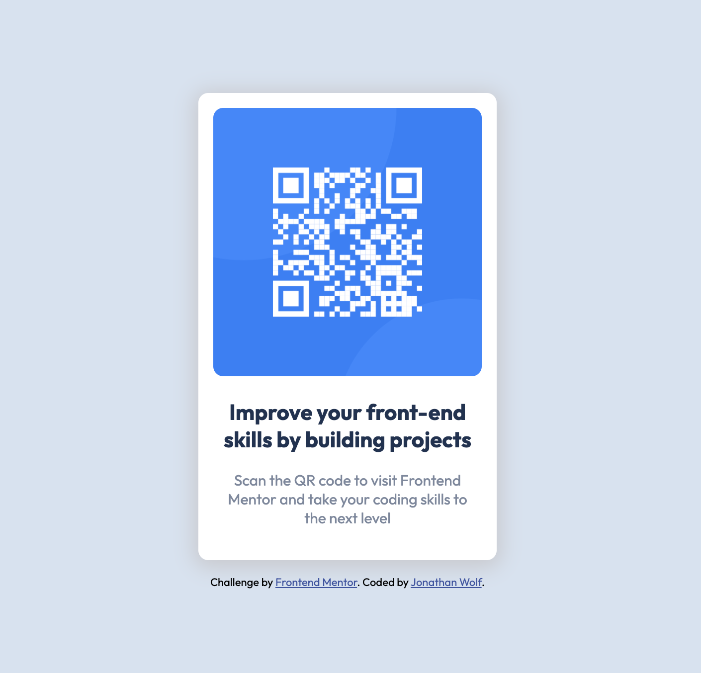

# Frontend Mentor - QR code component solution

This is a solution to the [QR code component challenge on Frontend Mentor](https://www.frontendmentor.io/challenges/qr-code-component-iux_sIO_H). Frontend Mentor challenges help you improve your coding skills by building realistic projects. 

## Table of contents

- [Overview](#overview)
  - [Screenshot](#screenshot)
  - [Links](#links)
- [My process](#my-process)
  - [Built with](#built-with)
  - [What I learned](#what-i-learned)
  - [Continued development](#continued-development)
  - [Useful resources](#useful-resources)
- [Author](#author)

## Overview

### Screenshot

### Links

- Live Site URL: [Add live site URL here](https://jwolf9.github.io/qr-code-component-main/)

## My process

### Built with

- css
- html
- sass

### What I learned

Learned how to use the Sass preprocessor to generate css files. Though I didn't use many of its features in this project, I think it will help me write more elegant, maintainable css in the future.

### Continued development

I want to get better at writing responsive web apps. Ones that can scale well with screen size

### Useful resources

- [sass docs](https://sass-lang.com/)

## Author

- Frontend Mentor - [@jwolf9](https://www.frontendmentor.io/profile/jwolf9)
